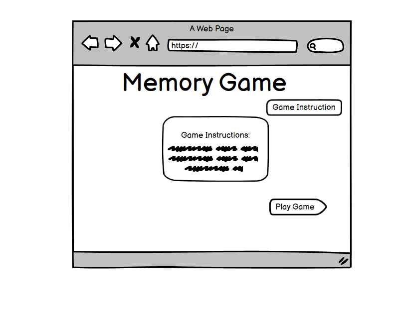
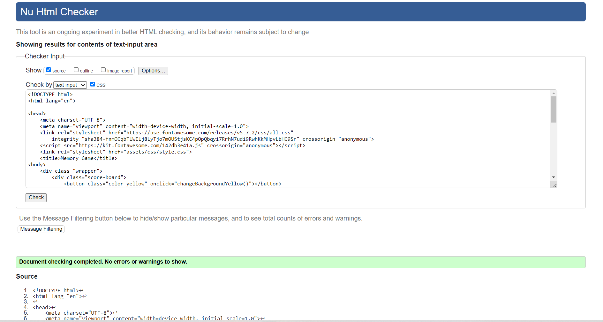
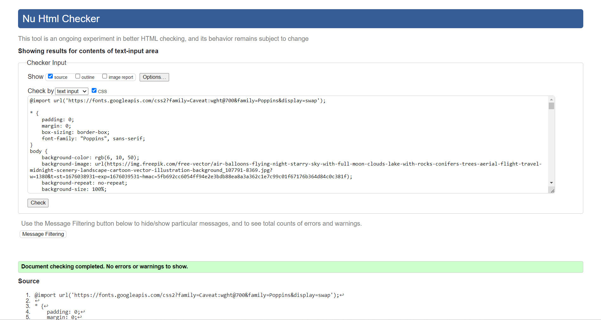

# Memory Game
Here is a very popular game called memory game. It's a fun game for both adults and children. Great exercise for memory and concentration.It is a great entertainment for people of all ages, which is not able to get bored and can make the time more pleasant. 

[View the live project here](https://mariaarnesson.github.io/project_memory/)

# Features
## User Experience 
### User stories:

- The user should be able to read the instructions of the game by reading the instructions on the homepage.
- The user should be able to see all 16 double-sided cards random selected.
- The user should be able to see the tab by clicking on it to match it with another card.
- The user should activate the timer by clicking on button: "Game Start".
- The user should activate the move counting by pressing on the first two cards.
- The user should be able to stop the game at any time during the game by pressing "Stop Game".
- The user should receive a message when all cards have been matched and how many moves have been made at the end of the game.
- The user should be able to play again after finishing the game by pressing: "Play Game"

## The Memory Game Logo:

- When the user open the page the first thing the user can see is the Memory Games logo as well as options to start the game or read the game instructions:

- The Game Area:
    - By pressing on "Play Game" the user will continue to the other side with the game area. 
    - The Timer starts and moves are counted each time the user selects two cards.
    - The user can choose any cards and match them together:

             

    - This is what all pairs of cards look like:

    - The final message looks like this:

## Features Left to Implement

-
-
-

# Design

## Wireframe:

## Colour Adobe

# Testing

## Validator Testing

- HTML
    - No errors were returned when passing through the officialW3C validator.
    
- CSS
    - No errors were found when passing through the official (Jigsaw) validator.
    
- JavaScript 
    - No errors were found when passing through the official Jshint validator.
    

## Lighthouse Testing

### Lighthouse Mobile:

    

### Lighthouse Desktop: 

    

# Deployment:
- The site was deployed to GitHub pages. The steps to deploy are as follows:
    - In the GitHub repository, I navigated to the Settings tab.
    - From the source section drop-down menu, I selected Pages.
    - Afrerwords I seleted main.

The live link can be found here - https://mariaarnesson.github.io/project_memory/

# Technologies Used
## Languages Used
- [HTML](https://sv.wikipedia.org/wiki/HTML)
- [CSS](https://en.wikipedia.org/wiki/CSS)
- [Javascript](https://sv.wikipedia.org/wiki/Javascript)

# Credits

## Content:
 - [Memory game JavaScript](https://www.youtube.com/watch?v=dqqxkrKhfS4&t=2s) this tutorial was followed and some JavaScript code was taken and adapted to my game.
 - [Adobe color](https://color.adobe.com/sv/create/image) this page was used to explain what colors I used to designe my game.
 - [Memory game](https://www.codingnepalweb.com/build-memory-card-game-html-javascript/) this page was used and a code which makes a animation to shake cards was taken.
 - [w3schools](https://www.w3schools.com/js/tryit.asp?filename=tryjs_setinterval3) My codes were based on information from that site
 
 ## Media:
 - [Freepik](https://www.freepik.com/search?format=search&query=memory%20game%20logo) All the pictures in my project were downloaded from this site

