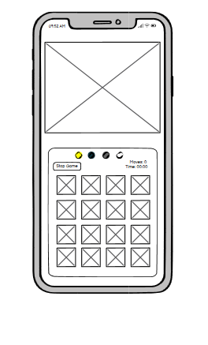

# Memory Game
Here is a very popular game called memory game. It's a fun game for both adults and children. Great exercise for memory and concentration.It is a great entertainment for people of all ages, which is not able to get bored and can make the time more pleasant. 

[View the live project here](https://mariaarnesson.github.io/project_memory/)

# Features
## User Experience 
### User stories:

- The user should be able to read the instructions of the game by reading the instructions on the homepage.
- The user should be able to see all 16 double-sided cards random selected.
- The user should be able to see the tab by clicking on it to match it with another card.
- The user should activate the timer by clicking on button: "Game Start".
- The user should activate the move counting by pressing on the first two cards.
- The user should be able to stop the game at any time during the game by pressing "Stop Game".
- The user should receive a message when all cards have been matched and how many moves have been made at the end of the game.
- The user should be able to play again after finishing the game by pressing: "Play Game"

# Design

## Wireframe:

## Colour Scheme

# Technologies Used
## Languages Used
- [HTML](https://sv.wikipedia.org/wiki/HTML)
- [CSS](https://en.wikipedia.org/wiki/CSS)
- [Javascript](https://sv.wikipedia.org/wiki/Javascript)
# Credits

- (https://www.youtube.com/watch?v=dqqxkrKhfS4&t=2s)

